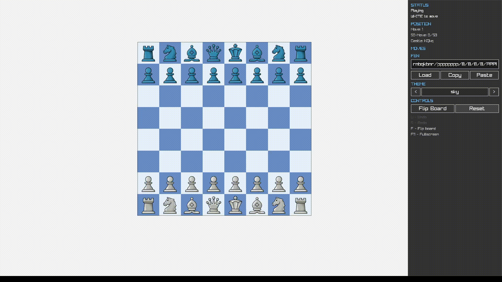

# Chess Engine & GUI

A fully-featured chess application built from scratch in **C++23**, featuring a custom chess engine and a cross-platform GUI that runs on **desktop and in the browser via WebAssembly**.

Play it live → **[GitHub Pages Demo](#)** *(add your link here)*

---



---

## Features

- **Complete chess rules** — legal move generation, check/checkmate/stalemate detection
- **Draw detection** — threefold repetition, fifty-move rule, insufficient material, stalemate
- **Move history** — full undo/redo with backward/forward navigation
- **FEN support** — import and export any position via [Forsyth-Edwards Notation](https://en.wikipedia.org/wiki/Forsyth%E2%80%93Edwards_Notation)
- **Drag & drop** — intuitive piece interaction with legal move highlighting
- **Pawn promotion** — interactive promotion modal
- **39 piece themes** — pixel-art, illustrated, 3D, classic, and more
- **Board flip** — play from either side
- **WebAssembly build** — runs in any modern browser, no install required
- **Automated deployment** — GitHub Actions CI/CD to GitHub Pages

---

## Tech Stack

| Area | Technology |
|------|-----------|
| Language | C++23 |
| Graphics | [Raylib](https://www.raylib.com/) |
| Web target | [Emscripten](https://emscripten.org/) (WebAssembly) |
| Build system | CMake 3.20+ |
| CI/CD | GitHub Actions |
| Platforms | Windows · Linux · macOS · Browser |

---

## Architecture

The project is split into two independent layers:

```
Mess/
├── engine/          # Chess logic — no GUI dependency
│   ├── include/chess/
│   │   ├── Game.hpp          # Game lifecycle & history
│   │   ├── Position.hpp      # Immutable position snapshots
│   │   ├── MoveGen.hpp       # Legal move generation
│   │   ├── Rules.hpp         # Check / checkmate / stalemate
│   │   ├── DrawDetector.hpp  # All draw conditions
│   │   └── MoveNotation.hpp  # UCI, SAN, LAN notation
│   └── tests/
│       └── engine_tests.cpp
├── gui/             # Raylib front-end
│   └── src/
│       ├── Game/             # Engine ↔ UI bridge
│       ├── Board/            # Board rendering
│       ├── DragDrop/         # Input handling
│       ├── Theme/            # 39 piece/board themes
│       └── UI/               # Controls & overlays
└── external/
    └── raylib/               # Git submodule
```

### Engine highlights

- **Pre-computed attack tables** for knights and kings — O(1) lookups
- **Ray-based sliding piece attacks** for bishops, rooks, and queens
- **Zobrist hashing** for O(1) threefold repetition detection
- **Immutable `Position` snapshots** enable safe, cheap history navigation
- Clean separation between `Board` (current state) and `Game` (full history)

---

## Getting Started

### Prerequisites

- CMake 3.20+
- A C++23-capable compiler (MSVC 2022, GCC 13+, or Clang 16+)
- Git (for submodule initialization)

### Clone

```bash
git clone --recurse-submodules https://github.com/YOUR_USERNAME/YOUR_REPO.git
cd YOUR_REPO
```

If you already cloned without `--recurse-submodules`:

```bash
git submodule update --init --recursive
```

### Desktop Build

```bash
cmake -S . -B build/Chess -DCMAKE_BUILD_TYPE=Release
cmake --build build/Chess --config Release
```

Run:

```bash
./build/Chess/gui/chess_gui        # Linux / macOS
build\Chess\gui\Release\chess_gui.exe  # Windows
```

### Web Build (WebAssembly)

Requires the [Emscripten SDK](https://emscripten.org/docs/getting_started/downloads.html).

```bash
emcmake cmake -S . -B build/Chess-web -DPLATFORM=Web
emmake make -C build/Chess-web -j$(nproc)
```

Open `build/Chess-web/chess_gui.html` in a browser, or serve it with:

```bash
python -m http.server 8080 --directory build/Chess-web
```

### Run Tests

```bash
./build/Chess/chess_engine_tests
```

---

## Controls

| Input | Action |
|-------|--------|
| Click / Drag | Select and move a piece |
| `F` | Flip the board |
| `F11` | Toggle fullscreen |
| FEN input field | Load any position |
| ← → buttons | Navigate move history |

---

## Piece Themes

39 built-in themes including `3d_chesskid`, `3d_staunton`, `3d_wood`, `8_bit`, `alpha`, `blindfold`, `book`, `classic`, `club`, and many more. Switch themes at runtime through the UI.

---

## Deployment

A GitHub Actions workflow (`.github/workflows/deploy.yml`) automatically builds the WebAssembly target and deploys it to GitHub Pages on every push to the `v2` branch. No manual steps required.

---

## Asset Credits

- Piece textures: [chess.com boards and pieces](https://github.com/GiorgioMegrelli/chess.com-boards-and-pieces)
- Chess pack: [itch.io](https://joszs.itch.io/chess-pack)

---

## License

MIT